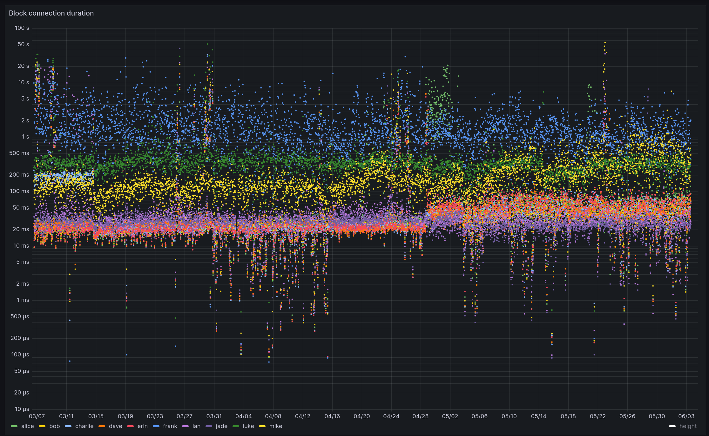

# Bitcoin Research - Peer Observer

## peer-observer: A tool and infrastructure for monitoring the Bitcoin P2P network for attacks and anomalies

Over the past few years, I’ve been working on monitoring tools for the Bitcoin network. One of these projects is [peer-observer](https://github.com/0xB10C/peer-observer): A tool and infrastructure for monitoring the Bitcoin P2P network for attacks and anomalies. This post describes the motivation for starting yet another Bitcoin network observer. It details how the tool works, what my honeypot infrastructure looks like, and finishes with an idea for a decentralized Bitcoin Network Operations Collective and incident response team.

### Motivation

At some point in late 2021, I stumbled across reports of an `addr` message flooding having happened a few months earlier on the Bitcoin network. It was first reported by Piotr Narewski, the maintainer of the [Gocoin](https://github.com/piotrnar/gocoin) Bitcoin node implementation, in a thread called [Loads of fake peers advertised on bitcoin network](https://bitcointalk.org/index.php?topic=5348856.0). Piotr details that his node was receiving “hundreds of thousands of non-working [IP] addresses” via the `addr` P2P message in July 2021. Since his node implementation stores all addresses[^1] , he is experiencing high resource usage and needs more connection attempts until a working peer is found.

[^1]:To avoid this problem, Bitcoin Core’s IP address manager (addrman) does not store all IP addresses it receives. It has a table with a fixed size and a DoS-resistant insertion and eviction policy.

Matthias Grundmann and Max Baumstark from the Karlsruhe Institute of Technology noticed this attack on their DSN Bitcoin Monitoring infrastructure, too. In a [preprint](https://arxiv.org/pdf/2108.00815v1) for a paper, they write: “Some peers in the Bitcoin P2P network distributed a huge amount of spam IP addresses during July 2021. These spam IP addresses did not belong to actual Bitcoin peers.”.

At the same time, the Bitcoin Core PR [#22387: Rate limit the processing of rumoured addresses](https://github.com/bitcoin/bitcoin/pull/22387), is being tested and reviewed. This PR implements rate-limiting for the number of addresses a peer can send to a node. Previously, Bitcoin Core would [“happily accept and process an effectively unbounded rate from attackers”](https://github.com/bitcoin/bitcoin/pull/22387#issue-935319998). During testing of this PR, reviewers [note](https://github.com/bitcoin/bitcoin/pull/22387#issuecomment-878411443) that the rate-limiting is being triggered by peers on mainnet. This is likely related to the same addr-flodding attack observed by Piotr, Matthias, and Max.

Three years later, the Bitcoin Core project discloses [CVE-2024-52919 - Remote crash due to addr message spam](https://bitcoincore.org/en/2024/07/31/disclose-addrman-int-overflow/) discovered by Eugene Siegel. An attacker could remotely crash Bitcoin Core nodes by spamming addr messages that would then be inserted into the `addrman`. The node would crash due to a 32-bit identifier overflowing. This was fixed by the rate limiting implemented in PR #22387 and then later changing the 32-bit identifier to a 64-bit identifier[^2].

[^2]:I don’t think the attacker tried to exploit CVE-2024-52919, but it remains unclear who the addr-flooding attacker and what motivation for this attack was.

Learning about this attack a few months after it happened, I started to wonder what other attacks are happening on the Bitcoin P2P network. While the `addr`-flodding attack was detected by a few different parties, I had the feeling that it would be good to not only learn about these attacks by coincidence. The idea for another Bitcoin network monitoring tool was born.

### The peer-observer tool

Early on, I decided that my monitoring should be passive and as minimally invasive to the Bitcoin network as possible. This means, for example, not to use up inbound connection slots by connecting to all possible Bitcoin nodes on the network. I decided to run multiple honeypot nodes that are normal, honest nodes that behave well and participate in block and transaction relay. They just have a lot of monitoring tools attached to them.

Since Bitcoin Core is currently the most widely used node software on the Bitcoin network, I choose to focus on it for now[^3]. This allows for testing out various Bitcoin Core node features and configuration options that could be susceptible to attacks or anomalies (i.e., bugs).

[^3]:With the recent popularity of Bitcoin Knots, I’m considering adding a Bitcoin Knots node or two into my setup. However, since Knots and Core share most of the codebase, I don’t think there should be a lot of new insights to gain from observing a Knots node. Additionally, the main promise of the Knots patch set is the limited mempool policy, which ideally should make it less susceptible to e.g., mempool-based Denial-of-Service attacks. If you’re nonetheless interested in sponsoring a Knots node for my monitoring infrastructure, please feel free to reach out.

#### Interfaces
To extract data and events about the P2P network and the peers connected to a Bitcoin Core node, interfaces are needed. To learn about events in real-time via machine-to-machine interface, I started implementing peer-observer primarily with the Bitcoin Core tracepoint interface [I’ve been working on](https://b10c.me/blog/008-bitcoin-core-usdt-support/) over the past few years. The tracepoint interface provides all data required for an MVP. As alternatives, I also considered parsing the Bitcoin Core debug.log similar to James O’Beirne’s [bmon](https://github.com/chaincodelabs/bmon) tool and fetching data from the RPC interface. The debug log is primarily an interface for humans and not machines. Parsing log messages that might change without warning over time didn’t seem optimal to me. Polling on the RPC interface doesn’t give me the required resolution. For example, between two calls to getpeerinfo, multiple peers might have connected and already disconnected.

Nonetheless, I’ve started exploring adding support for extracting data from [more interfaces](https://github.com/0xB10C/peer-observer/issues/141). The RPC interface, and particularly, `getpeerinfo`, can be useful to get more stateful information about peers. Since the tracepoint interface has a few pain points, I’ve also started thinking about an [IPC-based alternative.](https://github.com/bitcoin-core/libmultiprocess/issues/185) In the future, it might become worthwhile to supplement the data with parsed debug.log output, while keeping in mind that the log statements might change over time.

For peer-observer, I primarily use the [net](https://github.com/bitcoin/bitcoin/blob/29.x/doc/tracing.md) tracepoints to learn about in- and outbound P2P messages and opened, closed, evicted, or misbehaving connections. The [validation:block_connected](https://github.com/bitcoin/bitcoin/blob/29.x/doc/tracing.md#tracepoint-validationblock_connected) tracepoint, along with [mempool](https://github.com/bitcoin/bitcoin/blob/29.x/doc/tracing.md#context-mempool) tracepoints, are also interesting to get insights into block processing and the node’s mempool. For a while, I’ve also maintained custom tracepoints in a patch, for example, addrman tracepoints, to see how much effect peers can have on our addrman.

#### Extractors and Tools
To be able to process data from multiple Bitcoin Core interfaces in multiple tools, I choose a message queue that allows for multiple publishers and consumers. Extractors, like the `ebpf-extractor`, hooking into the tracepoint interface, publish events into the message queue. On the other end, subscribers or Tools consume these events and further process them. The most basic tool, called `logger`, just logs all received events. As a message queue peer-observer is using a [NATS.io](https://b10c.me/projects/024-peer-observer/NATS.io) server. Messages are serialized using protobuf.

```
                                                ┌──────────────────────┐
                                      NATS.io   │ Tools                │
                                      PUB-SUB   │                      │
                                         ┌──────┼──► logger            │
              Tracepoints                │      │                      │
┌───────────┐ via libbpf                 ├──────┼──► metrics           │
│  Bitcoin  │       ┌───────────────┐    │      │                      │
│ Core Node ├───────► ebpf-extractor├────┼──────┼──► websocket         │
└───────────┘       └───────────────┘    │      │                      │
                                         ├──────┼──► addr-connectivty  │
                                         │      │                      │
                                         └──────┼──►...                │
                                      protobuf  │                      │
                                      messages  └──────────────────────┘
```

#### `logger` tool

The [`logger` tool](https://github.com/0xB10C/peer-observer/tree/master/tools/logger) logs events to stdout and supports basic topic filtering (thanks to [Nasser](https://github.com/nassersaazi) for [PR #138](https://github.com/0xB10C/peer-observer/pull/138)). I mainly use it to show how much communication is happening between a Bitcoin Core node and its peers.

The output of the tool looks similar to the following snippet. Here, `<-` and `->` indicate an in- and outbound P2P message to or from our node. Connection events are marked with `# CONN`.

```text
 --> to id=11937171 (conn_type=1): wtxidrelay
 --> to id=11937171 (conn_type=1): sendaddrv2
 --> to id=11937171 (conn_type=1): verack
 <-- from id=10237648 (conn_type=1): Inv([WTx(205bfe2dfbeb46c7d91963a13097ef49511ad2d71c3018fdbdebbff83d8caa2f), WTx(0cd27eb1f63d95c0ec82adf0090756aef0eb1b1e840634ec7a4f440919ab991c), WTx(98bb7eb29ab06dcfdd30aa4875ebafcedd14da2738d63d0cc8d6dcc0f3a12e8b), WTx(a361125873bffb5d70636e50bac18bd71963821d05ba07d9d70c91e660779632)])
 <-- from id=10752006 (conn_type=1): AddrV2([Address(timestamp=1750941674, address=IPv4(XXX), port=8333, services=3077), Address(timestamp=1750941953, address=IPv4(XXX), port=8333, services=3081), Address(timestamp=1750941813, address=IPv6(XXX), port=8333, services=1032)])
 <-- from id=10162242 (conn_type=1): Inv([WTx(5a7a949a920cf57eacd8ad38906a56ba6882188dda4ff9ea5660aad35adf1ef4), WTx(1acc1f2f3ec70c4ffd2181783bb2407e204be39b1017b5ae13d45b9b54a19e43), WTx(5a68c9197c31b5629c146be6d789a44bbb03e2c43633216ec0ca8cd73bd737f2), WTx(78ad4525de5b0e03db2b552b0091275caf781d57b04affc468d960ba645c1370)])
 # CONN EvictedInboundConnection(conn=Connection(id=11937171, addr=<linkinglion>, conn_type=1, network=2), time_established=1750942328)
 # CONN InboundConnection(conn=Connection(id=11937172, addr=<linkinglion>, conn_type=1, network=1), existing_connections=115)
 # CONN ClosedConnection(conn=Connection(id=11937171, addr=<linkinglion>, conn_type=1, network=2), time_established=1750942328)
 <-- from id=11554724 (conn_type=1): Inv([WTx(12eff03d987ef34ec759abe864bd88c2ecb4c994bd23ac18680fed251440020a), WTx(1e34d5e8d3e34ee7257363a34c877ea6031f0657574c78d6d1379485e1a8b533), WTx(68ae6c3279f1797f08f90948d7599ec60a476f896013f164a49b38eae10c6cf9), WTx(d1d6a9a50d1059db07a8367e52a6569d989f2dcdde24e56369aae2aaab4cf0aa), WTx(8c3c1033296b4c593560f40fd22929cbcc6f63c3ec20287829e9b52dea9a4ea2), WTx(77c7e46e402f94c4a03445479e727b67008e105f2c97d3120e8c2d2008b6c6c3)])
 <-- from id=11875990 (conn_type=1): Pong(16368378148765531861)
 <-- from id=8950578 (conn_type=1): Inv([WTx(12eff03d987ef34ec759abe864bd88c2ecb4c994bd23ac18680fed251440020a), WTx(1e34d5e8d3e34ee7257363a34c877ea6031f0657574c78d6d1379485e1a8b533), WTx(68ae6c3279f1797f08f90948d7599ec60a476f896013f164a49b38eae10c6cf9), WTx(8c3c1033296b4c593560f40fd22929cbcc6f63c3ec20287829e9b52dea9a4ea2), WTx(77c7e46e402f94c4a03445479e727b67008e105f2c97d3120e8c2d2008b6c6c3)])
 <-- from id=11833825 (conn_type=1): Inv([WTx(5a7a949a920cf57eacd8ad38906a56ba6882188dda4ff9ea5660aad35adf1ef4), WTx(1acc1f2f3ec70c4ffd2181783bb2407e204be39b1017b5ae13d45b9b54a19e43), WTx(205bfe2dfbeb46c7d91963a13097ef49511ad2d71c3018fdbdebbff83d8caa2f), WTx(0cd27eb1f63d95c0ec82adf0090756aef0eb1b1e840634ec7a4f440919ab991c), WTx(a361125873bffb5d70636e50bac18bd71963821d05ba07d9d70c91e660779632), WTx(5de0156daa756bdcad84a93699972a6ecb451841f2404ad181bd540c87006756), WTx(f2c8df33b2ef2e15c6d239e05f651927b4108758d99bafb478e76b9f7827e19d)])
 --> to id=8444252 (conn_type=2): Inv([WTx(1e34d5e8d3e34ee7257363a34c877ea6031f0657574c78d6d1379485e1a8b533), WTx(68ae6c3279f1797f08f90948d7599ec60a476f896013f164a49b38eae10c6cf9), WTx(8c3c1033296b4c593560f40fd22929cbcc6f63c3ec20287829e9b52dea9a4ea2), WTx(77c7e46e402f94c4a03445479e727b67008e105f2c97d3120e8c2d2008b6c6c3)])
 <-- from id=11937172 (conn_type=1): Version(version=70016, services=3081, timestamp=1750942328, receiver=Address(timestamp=0, address=IPv4(XXX), port=8333, services=0), sender=Address(timestamp=0, address=IPv4(XXX), port=8333, services=0), nonce=0, user_agent=/bitcoinj:0.14.5/Bitcoin Wallet:5.40/, start_height=902650, relay=true)
 --> to id=11937172 (conn_type=1): Version(version=70016, services=3080, timestamp=1750942328, receiver=Address(timestamp=0, address=IPv4(XXX), port=62311, services=0), sender=Address(timestamp=0, address=IPv4(0.0.0.0), port=0, services=3080), nonce=redacted, user_agent=/Satoshi:28.00.0/, start_height=902811, relay=true)
 --> to id=11937172 (conn_type=1): wtxidrelay
 --> to id=11937172 (conn_type=1): sendaddrv2
 --> to id=11937172 (conn_type=1): verack
 <-- from id=11937172 (conn_type=1): verack
 --> to id=11937172 (conn_type=1): SendCompact(send_compact=false, version=2)
 --> to id=11937172 (conn_type=1): Ping(2927426282439637971)
```

#### `metrics` tool

The [metrics tool](https://github.com/0xB10C/peer-observer/tree/master/tools/metrics) transforms individual events into aggregated statistics and serves them as Prometheus metrics. These metrics can then be displayed in Grafana dashboards. This allows for visual exploration and dashboard playlists that can help to detect attacks and anomalies visually. While there are some Grafana alerts for restarted nodes and inbound connections dropping, more work can be done on automatic anomaly detection. For this, the Prometheus recording rules mentioned in [#13 (comment)](https://github.com/0xB10C/peer-observer/issues/13#issuecomment-2404570158) could be useful to explore.



A Grafana dashboard showing the time it takes to connect blocks per node. Some nodes are faster than others due to hardware and configuration differences. For example, node frank is usually slower as it doesn’t have a mempool and needs to validate all transactions. The other nodes already have validated the transactions. An interactive version of this dashboard can be found on [snapshots.raintank.io](https://snapshots.raintank.io/dashboard/snapshot/lH8uj0MNKO9BIZEi39iivDmiEzROLFQP).