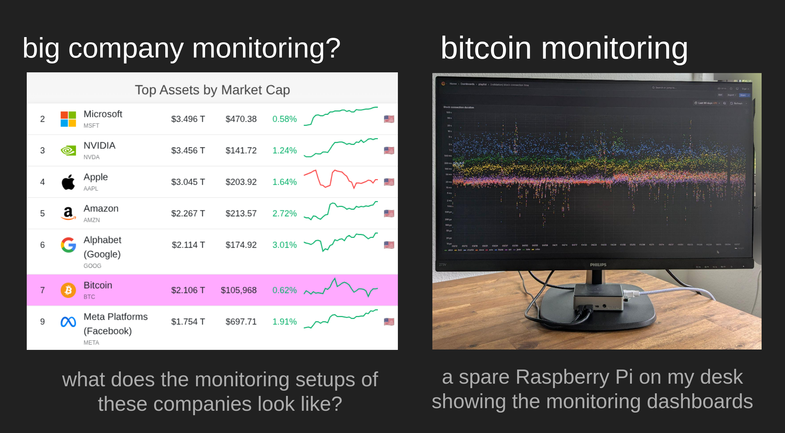

# Investigación de Bitcoin - Observador de Pares

## peer-observer: Una herramienta e infraestructura para monitorear la red P2P de Bitcoin en busca de ataques y anomalías

Durante los últimos años, he estado trabajando en herramientas de monitoreo para la red de Bitcoin. Uno de estos proyectos es [peer-observer](https://github.com/0xB10C/peer-observer): Una herramienta e infraestructura para monitorear la red P2P de Bitcoin en busca de ataques y anomalías. Esta publicación describe la motivación para iniciar otro observador de la red de Bitcoin. Detalla cómo funciona la herramienta, cómo se ve mi infraestructura de honeypot, y termina con una idea para un Colectivo de Operaciones de Red de Bitcoin descentralizado y un equipo de respuesta a incidentes.

### Motivación

En algún momento de finales de 2021, me topé con informes de una inundación de mensajes `addr` que había ocurrido unos meses antes en la red de Bitcoin. Fue reportado por primera vez por Piotr Narewski, el mantenedor de la implementación de nodo de Bitcoin [Gocoin](https://github.com/piotrnar/gocoin), en un hilo llamado [Loads of fake peers advertised on bitcoin network](https://bitcointalk.org/index.php?topic=5348856.0). Piotr detalla que su nodo estaba recibiendo "cientos de miles de direcciones [IP] que no funcionan" a través del mensaje P2P `addr` en julio de 2021. Como su implementación de nodo almacena todas las direcciones[^1], experimenta un alto uso de recursos y necesita más intentos de conexión hasta que se encuentra un par que funcione.

[^1]: Para evitar este problema, el administrador de direcciones IP de Bitcoin Core (addrman) no almacena todas las direcciones IP que recibe. Tiene una tabla con un tamaño fijo y una política de inserción y expulsión resistente a DoS.

Matthias Grundmann y Max Baumstark del Instituto de Tecnología de Karlsruhe también notaron este ataque en su infraestructura de Monitoreo DSN de Bitcoin. En un [preprint](https://arxiv.org/pdf/2108.00815v1) para un artículo, escriben: "Algunos pares en la red P2P de Bitcoin distribuyeron una gran cantidad de direcciones IP de spam durante julio de 2021. Estas direcciones IP de spam no pertenecían a pares reales de Bitcoin.".

Al mismo tiempo, el PR de Bitcoin Core [#22387: Rate limit the processing of rumoured addresses](https://github.com/bitcoin/bitcoin/pull/22387), está siendo probado y revisado. Este PR implementa limitación de tasa para el número de direcciones que un par puede enviar a un nodo. Anteriormente, Bitcoin Core ["acepta felizmente y procesa una tasa efectivamente ilimitada de atacantes"](https://github.com/bitcoin/bitcoin/pull/22387#issue-935319998). Durante las pruebas de este PR, los revisores [notan](https://github.com/bitcoin/bitcoin/pull/22387#issuecomment-878411443) que la limitación de tasa está siendo activada por pares en mainnet. Esto probablemente está relacionado con el mismo ataque de inundación de addr observado por Piotr, Matthias y Max.

Tres años después, el proyecto Bitcoin Core divulga [CVE-2024-52919 - Remote crash due to addr message spam](https://bitcoincore.org/en/2024/07/31/disclose-addrman-int-overflow/) descubierto por Eugene Siegel. Un atacante podría hacer crash remoto a los nodos de Bitcoin Core enviando spam de mensajes addr que luego se insertarían en el `addrman`. El nodo haría crash debido a un desbordamiento del identificador de 32 bits. Esto fue corregido por la limitación de tasa implementada en el PR #22387 y luego cambiando el identificador de 32 bits a uno de 64 bits[^2].

[^2]: No creo que el atacante haya tratado de explotar CVE-2024-52919, pero sigue sin estar claro quién era el atacante de inundación de addr y cuál era su motivación para este ataque.

Al aprender sobre este ataque unos meses después de que ocurriera, comencé a preguntarme qué otros ataques están sucediendo en la red P2P de Bitcoin. Aunque el ataque de inundación de `addr` fue detectado por unas pocas partes diferentes, tuve la sensación de que sería bueno no solo aprender sobre estos ataques por casualidad. Nació la idea de otra herramienta de monitoreo de la red de Bitcoin.

### La herramienta peer-observer

Desde el principio, decidí que mi monitoreo debería ser pasivo y lo menos invasivo posible para la red de Bitcoin. Esto significa, por ejemplo, no usar espacios de conexión entrante conectándose a todos los posibles nodos de Bitcoin en la red. Decidí ejecutar múltiples nodos honeypot que son nodos normales y honestos que se comportan bien y participan en el relay de bloques y transacciones. Solo tienen muchas herramientas de monitoreo adjuntas.

Como Bitcoin Core es actualmente el software de nodo más ampliamente usado en la red de Bitcoin, elegí enfocarme en él por ahora[^3]. Esto permite probar varias características y opciones de configuración de nodos de Bitcoin Core que podrían ser susceptibles a ataques o anomalías (es decir, bugs).

[^3]: Con la popularidad reciente de Bitcoin Knots, estoy considerando agregar uno o dos nodos de Bitcoin Knots a mi configuración. Sin embargo, como Knots y Core comparten la mayor parte del código base, no creo que debería haber muchas nuevas percepciones que ganar al observar un nodo Knots. Además, la promesa principal del conjunto de parches de Knots es la política limitada de mempool, que idealmente debería hacerlo menos susceptible a, por ejemplo, ataques de Denegación de Servicio basados en mempool. Si aún estás interesado en patrocinar un nodo Knots para mi infraestructura de monitoreo, por favor siéntete libre de contactarme.

#### Interfaces
Para extraer datos y eventos sobre la red P2P y los pares conectados a un nodo de Bitcoin Core, se necesitan interfaces. Para aprender sobre eventos en tiempo real a través de una interfaz máquina a máquina, comencé implementando peer-observer principalmente con la interfaz de tracepoint de Bitcoin Core [en la que he estado trabajando](https://b10c.me/blog/008-bitcoin-core-usdt-support/) durante los últimos años. La interfaz de tracepoint proporciona todos los datos requeridos para un MVP. Como alternativas, también consideré parsear el debug.log de Bitcoin Core similar a la herramienta [bmon](https://github.com/chaincodelabs/bmon) de James O'Beirne y obtener datos de la interfaz RPC. El debug log es principalmente una interfaz para humanos y no máquinas. Parsear mensajes de log que podrían cambiar sin advertencia a lo largo del tiempo no me parecía óptimo. Hacer polling en la interfaz RPC no me da la resolución requerida. Por ejemplo, entre dos llamadas a getpeerinfo, múltiples pares podrían haberse conectado y ya desconectado.

No obstante, he comenzado a explorar agregar soporte para extraer datos de [más interfaces](https://github.com/0xB10C/peer-observer/issues/141). La interfaz RPC, y particularmente, `getpeerinfo`, puede ser útil para obtener información más con estado sobre los pares. Como la interfaz de tracepoint tiene algunos puntos de dolor, también he comenzado a pensar en una [alternativa basada en IPC.](https://github.com/bitcoin-core/libmultiprocess/issues/185) En el futuro, podría valer la pena suplementar los datos con salida de debug.log parseada, manteniendo en mente que las declaraciones de log podrían cambiar con el tiempo.

Para peer-observer, principalmente uso los tracepoints de [net](https://github.com/bitcoin/bitcoin/blob/29.x/doc/tracing.md) para aprender sobre mensajes P2P entrantes y salientes y conexiones abiertas, cerradas, expulsadas o con mal comportamiento. El tracepoint [validation:block_connected](https://github.com/bitcoin/bitcoin/blob/29.x/doc/tracing.md#tracepoint-validationblock_connected), junto con los tracepoints de [mempool](https://github.com/bitcoin/bitcoin/blob/29.x/doc/tracing.md#context-mempool), también son interesantes para obtener información sobre el procesamiento de bloques y el mempool del nodo. Por un tiempo, también he mantenido tracepoints personalizados en un parche, por ejemplo, tracepoints de addrman, para ver cuánto efecto pueden tener los pares en nuestro addrman.

#### Extractores y Herramientas
Para poder procesar datos de múltiples interfaces de Bitcoin Core en múltiples herramientas, elijo una cola de mensajes que permite múltiples publicadores y consumidores. Los extractores, como el `ebpf-extractor`, que se enganchan a la interfaz de tracepoint, publican eventos en la cola de mensajes. En el otro extremo, los suscriptores o Herramientas consumen estos eventos y los procesan más. La herramienta más básica, llamada `logger`, simplemente registra todos los eventos recibidos. Como cola de mensajes, peer-observer está usando un servidor [NATS.io](https://b10c.me/projects/024-peer-observer/NATS.io). Los mensajes se serializan usando protobuf.

```
                                                ┌──────────────────────┐
                                      NATS.io   │ Tools                │
                                      PUB-SUB   │                      │
                                         ┌──────┼──► logger            │
              Tracepoints                │      │                      │
┌───────────┐ via libbpf                 ├──────┼──► metrics           │
│  Bitcoin  │       ┌───────────────┐    │      │                      │
│ Core Node ├───────► ebpf-extractor├────┼──────┼──► websocket         │
└───────────┘       └───────────────┘    │      │                      │
                                         ├──────┼──► addr-connectivty  │
                                         │      │                      │
                                         └──────┼──►...                │
                                      protobuf  │                      │
                                      messages  └──────────────────────┘
```

#### Herramienta `logger`

La [herramienta `logger`](https://github.com/0xB10C/peer-observer/tree/master/tools/logger) registra eventos a stdout y soporta filtrado básico de temas (gracias a [Nasser](https://github.com/nassersaazi) por el [PR #138](https://github.com/0xB10C/peer-observer/pull/138)). La uso principalmente para mostrar cuánta comunicación está ocurriendo entre un nodo de Bitcoin Core y sus pares.

La salida de la herramienta se ve similar al siguiente fragmento. Aquí, `<-` y `->` indican un mensaje P2P entrante y saliente hacia o desde nuestro nodo. Los eventos de conexión están marcados con `# CONN`.

```text
 --> to id=11937171 (conn_type=1): wtxidrelay
 --> to id=11937171 (conn_type=1): sendaddrv2
 --> to id=11937171 (conn_type=1): verack
 <-- from id=10237648 (conn_type=1): Inv([WTx(205bfe2dfbeb46c7d91963a13097ef49511ad2d71c3018fdbdebbff83d8caa2f), WTx(0cd27eb1f63d95c0ec82adf0090756aef0eb1b1e840634ec7a4f440919ab991c), WTx(98bb7eb29ab06dcfdd30aa4875ebafcedd14da2738d63d0cc8d6dcc0f3a12e8b), WTx(a361125873bffb5d70636e50bac18bd71963821d05ba07d9d70c91e660779632)])
 <-- from id=10752006 (conn_type=1): AddrV2([Address(timestamp=1750941674, address=IPv4(XXX), port=8333, services=3077), Address(timestamp=1750941953, address=IPv4(XXX), port=8333, services=3081), Address(timestamp=1750941813, address=IPv6(XXX), port=8333, services=1032)])
 <-- from id=10162242 (conn_type=1): Inv([WTx(5a7a949a920cf57eacd8ad38906a56ba6882188dda4ff9ea5660aad35adf1ef4), WTx(1acc1f2f3ec70c4ffd2181783bb2407e204be39b1017b5ae13d45b9b54a19e43), WTx(5a68c9197c31b5629c146be6d789a44bbb03e2c43633216ec0ca8cd73bd737f2), WTx(78ad4525de5b0e03db2b552b0091275caf781d57b04affc468d960ba645c1370)])
 # CONN EvictedInboundConnection(conn=Connection(id=11937171, addr=<linkinglion>, conn_type=1, network=2), time_established=1750942328)
 # CONN InboundConnection(conn=Connection(id=11937172, addr=<linkinglion>, conn_type=1, network=1), existing_connections=115)
 # CONN ClosedConnection(conn=Connection(id=11937171, addr=<linkinglion>, conn_type=1, network=2), time_established=1750942328)
 <-- from id=11554724 (conn_type=1): Inv([WTx(12eff03d987ef34ec759abe864bd88c2ecb4c994bd23ac18680fed251440020a), WTx(1e34d5e8d3e34ee7257363a34c877ea6031f0657574c78d6d1379485e1a8b533), WTx(68ae6c3279f1797f08f90948d7599ec60a476f896013f164a49b38eae10c6cf9), WTx(d1d6a9a50d1059db07a8367e52a6569d989f2dcdde24e56369aae2aaab4cf0aa), WTx(8c3c1033296b4c593560f40fd22929cbcc6f63c3ec20287829e9b52dea9a4ea2), WTx(77c7e46e402f94c4a03445479e727b67008e105f2c97d3120e8c2d2008b6c6c3)])
 <-- from id=11875990 (conn_type=1): Pong(16368378148765531861)
 <-- from id=8950578 (conn_type=1): Inv([WTx(12eff03d987ef34ec759abe864bd88c2ecb4c994bd23ac18680fed251440020a), WTx(1e34d5e8d3e34ee7257363a34c877ea6031f0657574c78d6d1379485e1a8b533), WTx(68ae6c3279f1797f08f90948d7599ec60a476f896013f164a49b38eae10c6cf9), WTx(8c3c1033296b4c593560f40fd22929cbcc6f63c3ec20287829e9b52dea9a4ea2), WTx(77c7e46e402f94c4a03445479e727b67008e105f2c97d3120e8c2d2008b6c6c3)])
 <-- from id=11833825 (conn_type=1): Inv([WTx(5a7a949a920cf57eacd8ad38906a56ba6882188dda4ff9ea5660aad35adf1ef4), WTx(1acc1f2f3ec70c4ffd2181783bb2407e204be39b1017b5ae13d45b9b54a19e43), WTx(205bfe2dfbeb46c7d91963a13097ef49511ad2d71c3018fdbdebbff83d8caa2f), WTx(0cd27eb1f63d95c0ec82adf0090756aef0eb1b1e840634ec7a4f440919ab991c), WTx(a361125873bffb5d70636e50bac18bd71963821d05ba07d9d70c91e660779632), WTx(5de0156daa756bdcad84a93699972a6ecb451841f2404ad181bd540c87006756), WTx(f2c8df33b2ef2e15c6d239e05f651927b4108758d99bafb478e76b9f7827e19d)])
 --> to id=8444252 (conn_type=2): Inv([WTx(1e34d5e8d3e34ee7257363a34c877ea6031f0657574c78d6d1379485e1a8b533), WTx(68ae6c3279f1797f08f90948d7599ec60a476f896013f164a49b38eae10c6cf9), WTx(8c3c1033296b4c593560f40fd22929cbcc6f63c3ec20287829e9b52dea9a4ea2), WTx(77c7e46e402f94c4a03445479e727b67008e105f2c97d3120e8c2d2008b6c6c3)])
 <-- from id=11937172 (conn_type=1): Version(version=70016, services=3081, timestamp=1750942328, receiver=Address(timestamp=0, address=IPv4(XXX), port=8333, services=0), sender=Address(timestamp=0, address=IPv4(XXX), port=8333, services=0), nonce=0, user_agent=/bitcoinj:0.14.5/Bitcoin Wallet:5.40/, start_height=902650, relay=true)
 --> to id=11937172 (conn_type=1): Version(version=70016, services=3080, timestamp=1750942328, receiver=Address(timestamp=0, address=IPv4(XXX), port=62311, services=0), sender=Address(timestamp=0, address=IPv4(0.0.0.0), port=0, services=3080), nonce=redacted, user_agent=/Satoshi:28.00.0/, start_height=902811, relay=true)
 --> to id=11937172 (conn_type=1): wtxidrelay
 --> to id=11937172 (conn_type=1): sendaddrv2
 --> to id=11937172 (conn_type=1): verack
 <-- from id=11937172 (conn_type=1): verack
 --> to id=11937172 (conn_type=1): SendCompact(send_compact=false, version=2)
 --> to id=11937172 (conn_type=1): Ping(2927426282439637971)
```

#### Herramienta `metrics`

La [herramienta metrics](https://github.com/0xB10C/peer-observer/tree/master/tools/metrics) transforma eventos individuales en estadísticas agregadas y los sirve como métricas de Prometheus. Estas métricas pueden entonces mostrarse en dashboards de Grafana. Esto permite exploración visual y listas de reproducción de dashboards que pueden ayudar a detectar ataques y anomalías visualmente. Aunque hay algunas alertas de Grafana para nodos reiniciados y conexiones entrantes que se desconectan, se puede hacer más trabajo en detección automática de anomalías. Para esto, las reglas de grabación de Prometheus mencionadas en [#13 (comment)](https://github.com/0xB10C/peer-observer/issues/13#issuecomment-2404570158) podrían ser útiles para explorar.

 Un dashboard de Grafana mostrando el tiempo que toma conectar bloques por nodo. Algunos nodos son más rápidos que otros debido a diferencias de hardware y configuración. Por ejemplo, el nodo frank suele ser más lento ya que no tiene mempool y necesita validar todas las transacciones. Los otros nodos ya han validado las transacciones. Una versión interactiva de este dashboard se puede encontrar en [snapshots.raintank.io](https://snapshots.raintank.io/dashboard/snapshot/lH8uj0MNKO9BIZEi39iivDmiEzROLFQP).

#### Herramienta `websocket`

La herramienta websocket publica los eventos de NATS a un websocket como objetos JSON. Esto nos permite trabajar con los eventos en un navegador y permite construir herramientas web y visualizaciones. Un ejemplo es la página p2p-circle.html, que muestra el nodo conectado a peer-observer en el medio y organiza los pares del nodo en un círculo alrededor de él. Se muestran los mensajes intercambiados y las conexiones abiertas y cerradas.


El video muestra la página p2p-circle.html con el nodo peer-observer en el medio y sus pares organizados en un círculo alrededor de él. Los pares están etiquetados con su peer-id y coloreados por tipo de conexión: los pares azules son conexiones entrantes, los rojos son full-relay-outbound, y los pares amarillos son block-only-outbound. Además, se puede ver el intercambio de mensajes P2P entre el nodo y sus pares, y nuevas conexiones entrantes siendo aceptadas y otras siendo cerradas.

#### La infraestructura peer-observer
Al momento de escribir, hospedo 12 nodos honeypot con diferentes configuraciones alrededor del mundo como parte de la infraestructura peer-observer. Ejecutar nodos con diferentes configuraciones significa tener una superficie de ataque más grande, y al mismo tiempo, ser capaz de detectar anomalías para más características. Algunos nodos ejecutan con redes de privacidad como Tor e I2P habilitadas. Un atacante podría preferir atacar a través de estas para evitar dejar un rastro de direcciones IP. Algunos nodos tienen bloom filters (conocidos por ser vulnerables a DoS, y observados en [bitcoinj/bitcoinj #3404](https://github.com/bitcoinj/bitcoinj/issues/3404)) y compact block filters habilitados. Otros ejecutan con una lista de baneos para bloquear, por ejemplo, conexiones de [LinkingLion](https://b10c.me/observations/06-linkinglion/), y algunos están probando un archivo [ASMap](https://asmap.org/). Algunos nodos están podados, otros no. Algunos aceptan un número incrementado de conexiones entrantes, algunos no tienen mempool y solo procesan bloques, mientras que otros ejecutan detrás de un NAT y solo pueden aceptar conexiones entrantes de Tor, I2P y CJDNS. Unos pocos nodos ejecutan binarios compilados con sanitizers LLVM (particularmente ASan y UBSan) habilitados. La mayoría de nodos ejecutan en x86_64, pero también tengo unos pocos en aarch64. Generalmente, los nodos pueden ejecutar con diferentes PRs, versiones master, release candidates, o releases de Bitcoin Core. Todos los nodos están configurados con logging detallado de debug.log habilitado. Al momento de escribir, he recolectado más de 35 TB4 de debug logs, que pueden usarse en futuros proyectos de investigación.

El [MIT DCI](https://dci.mit.edu/) generosamente patrocinó seis nodos entre junio 2023 y abril 2025. Estoy agradecido por su confianza y apoyo en construir este proyecto. También, gracias a Sam, quien ha sido muy agradable para trabajar. En abril 2025, [Brink](https://b10c.me/projects/024-peer-observer/brink.dev) se hizo cargo del patrocinio de estos seis nodos. Los otros seis nodos están actualmente pagados por mí, al igual que el almacenamiento de archivo, servidores web y de base de datos. Una lista pública de nodos se puede encontrar en [public.peer.observer](https://public.peer.observer/). Como los nodos se supone que son nodos honeypot, no puedo compartir direcciones IP de nodos, detalles de hospedaje y datos públicamente. Un atacante sabría qué nodos ignorar al atacar. He estado pensando en configurar un nodo demo con un frontend público y dirección IP pública para que la gente explore y experimente. Sin embargo, he tenido elementos más urgentes en mi backlog por ahora.

Para manejar y desplegar nodos a diferentes proveedores de nube y hardware con diferentes configuraciones de nodo y versiones, [NixOS](https://b10c.me/projects/024-peer-observer/nixos.org) ha demostrado ser una herramienta útil. Me permite escribir la infraestructura como código, rastrearla en git, y tener despliegues reproducibles a través de hosts. Sin ella, no creo que mantener la infraestructura peer-observer hubiera sido posible como un trabajo de una sola persona. El paquete Nix y módulo NixOS para peer-observer están publicados en [0xb10c/nix](https://github.com/0xb10c/nix), y creo que puedo publicar un Flake de NixOS para la configuración del nodo en algún punto mientras mantengo mi infraestructura en un Flake separado y privado.

Junto a peer-observer y nodos de Bitcoin Core, la infraestructura también incluye una instancia de [fork-observer](https://github.com/0xB10C/fork-observer) conectada a los nodos (esto es [públicamente accesible](https://public.peer.observer/forks/)) y una instalación de [addrman-observer](https://github.com/0xB10C/addrman-observer), que permite ver el addrman de los nodos. Junto a la herramienta metrics, cada host ejecuta un [node_exporter](https://github.com/prometheus/node_exporter) que permite a Prometheus obtener métricas de CPU, RAM, disco, red y más. Además, un [process_exporter](https://github.com/ncabatoff/process-exporter) exporta métricas del tiempo de CPU gastado en cada hilo de Bitcoin Core. Cada host también ejecuta un servicio que sube los logs de Bitcoin Core a un recurso compartido de datos remoto.

#### Algunos hallazgos de peer-observer

Mientras construía las herramientas e infraestructura, ya hice unas pocas observaciones de ataques y anomalías, y tuve la oportunidad de usar los datos del nodo para investigar la eficiencia del relay de compact blocks. Estoy enlazando a algunos escritos abajo.

Temprano, descubrí una entidad que llamo [LinkingLion](https://b10c.me/observations/06-linkinglion/), que abre múltiples conexiones a nodos de Bitcoin y escucha anuncios de transacciones. La entidad ha estado activa desde al menos 2018 y se está conectando a nodos en la red de Monero también. Asumo que la entidad es una compañía de análisis blockchain recolectando datos para mejorar sus productos. Esto es un ataque de privacidad a los usuarios de Bitcoin. Tener acceso a datos de múltiples nodos hace posible detectar ataques como estos.

En mayo 2023, noté una anomalía en el número de conexiones entrantes en uno de mis nodos peer-observer. Sus conexiones entrantes cayeron, y el nodo tenía 100% de utilización de CPU. Investigándolo, resultó que un caso límite en la implementación del relay de transacciones de Bitcoin Core había sido activado, y el nodo no podía mantenerse al día con la operación normal. Como muchos nodos en la red fueron afectados por esto, tuvo un efecto en toda la red al punto donde el relay de bloques y transacciones fue impactado. He escrito mis notas de entonces en esta [publicación](https://b10c.me/observations/15-inv-to-send-queue/). Tener más monitoreo y nodos en ese entonces hubiera ayudado a identificar y reaccionar a esta anomalía más rápido.

Una de mis metas siempre ha sido extraer percepciones de los datos y alimentarlas de vuelta al desarrollo de Bitcoin. Con logs detallados e históricos de múltiples nodos disponibles, publiqué [Stats on compact block reconstructions](https://delvingbitcoin.org/t/stats-on-compact-block-reconstructions/1052). Esto llevó a una discusión renovada sobre prellenar compact blocks para mejorar el relay de bloques. Espero volver a terminar la implementación de esto en algún punto.

Hay muchos más datos que procesar y monitoreo que construir. No puedo monitorear la red de Bitcoin, analizar datos y construir herramientas solo. Esto podría fácilmente ser un esfuerzo de tiempo completo para un pequeño equipo de desarrolladores y científicos de datos. Estaría muy feliz de compartir datos y ayudar con el procesamiento, análisis y publicación de hallazgos. También estoy seguro de que encontrar financiamiento para este trabajo, dado algún Proof-of-Work previo, no es demasiado difícil en este momento.


#### Un Colectivo de Operaciones de Red de Bitcoin

Como se mencionó arriba, noté que podría usar unas pocas manos que ayuden que estén interesadas en monitorear la salud de la red de Bitcoin y analizar datos para proporcionar retroalimentación basada en datos para el desarrollo. Al momento de escribir, Bitcoin tiene una capitalización de mercado bien sobre $2T USD. Eso es más que Meta y Google, y cerca de Amazon. ¿Qué infraestructura de monitoreo, Centros de Operación de Red y equipos de respuesta a incidentes tienen estas compañías para protegerse contra ataques y anomalías? ¿Y qué tiene Bitcoin?

 Estado actual del monitoreo de Bitcoin comparado con compañías con una capitalización de mercado similar.

Hay unos pocos desarrolladores que conozco ejecutando nodos y mirando logs, el KIT DSN está ejecutando su infraestructura de [Bitcoin Network Monitoring](https://www.dsn.kastel.kit.edu/bitcoin/), una Universidad Brasileña está construyendo un Bitcoin Monitoring Lab, escuché, y [statoshi.info](https://statoshi.info/) de Lopp aún está ejecutando. Y tengo una Raspberry Pi de repuesto en mi escritorio que cicla a través de unos pocos dashboards de Grafana y podría recibir un ping a mi teléfono si en algún nodo las conexiones caen más rápido de lo esperado. ¿Qué pasa cuando estoy durmiendo, de vacaciones, o simplemente no tengo tiempo para investigarlo?

Con herramientas e infraestructura inicial en su lugar, he estado pensando sobre el próximo paso para mejorar la situación. Si Bitcoin fuera una compañía, se podría formar un Centro de Operaciones de Red, y se podría contratar gente para un equipo de respuesta a incidentes. En Bitcoin, esto funciona de manera diferente, y algunos podrían incluso rechazar un Centro de Operaciones de Red como demasiado centralizador. De manera similar, no se puede contratar gente para un trabajo así. Creo que necesitan ser autodirigidos, curiosos sobre el comportamiento de los participantes de la red, y motivados para asegurar la longevidad de Bitcoin y su red.

Lo que he estado pensando podría describirse mejor como un Colectivo de Operaciones de Red. Un grupo suelto y descentralizado de gente que comparte el interés de monitorear la Red de Bitcoin. Un colectivo para permitir compartir ideas, discusión, datos, herramientas, percepciones y más. Tal vez con un canal de chat, un foro, un almacén de datos compartido, y acceso a, por ejemplo, herramientas de monitoreo como mi peer-observer. Un lugar donde un incidente de la red de Bitcoin podría ser analizado, discutido, e idealmente resuelto, incluso si algunos miembros no están en línea. Un colectivo con buenas relaciones con desarrolladores, compañías y la comunidad, para poder contactar y ser contactable si se requiere.

No estoy seguro si el tiempo es correcto para esta idea aún, y probablemente pensaré sobre ello por un poco más. Si tienes alguna entrada sobre esta idea, quieres apoyarla, o quieres involucrarte más en monitorear la red de Bitcoin en alguna capacidad, por favor contáctame. Si aún no tienes un canal de comunicación abierto conmigo, siéntete libre de escribir un email a `bitcoin-noc@(domain of my blog)`.

Todo el texto e imágenes en este trabajo están licenciados bajo una [Licencia Creative Commons Attribution-ShareAlike 4.0 International Creative Commons License](http://creativecommons.org/licenses/by-sa/4.0/)